[TOC]


#  标签

## 1. 标题介绍与应用

标题（heading）是通过==<h1> - <h6>==标签进行定义的

`h1`定义最大标题 `h6`定义最小标题

```html
<h1>一级标题</h1>
<h2>二级标题</h2>
<h3>三级标题</h3>
<h4>四级标题</h4>
<h5>五级标题</h5>
<h6>六级标题</h6>
```


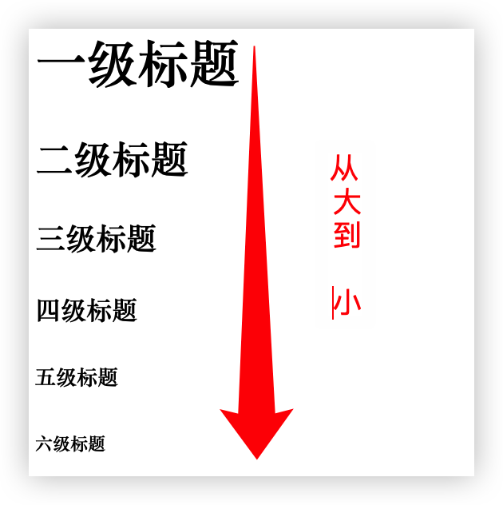

>生成h1~h6快捷键： h$*6

### 标题标签位置摆放属性

在标题中添加属性：==align="left | centre | right"== 默认居左


---


## 2. P标签之段落、换行、水平线

### P标签之段落

段落是通过`<p>`标签定义的

```html
<p>这是一个段落</p>
<p>这是另一个段落</p>
```

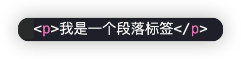

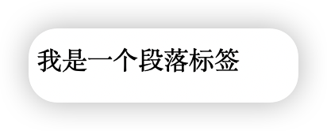

### br换行

如果您希望不再产生一个新段落的情况下进行换行（新行），请使用

`<br />`元素是一个空的HTMl元素

```html
<p>这个<br />段落<br />演示了分行的效果</p>
```

 

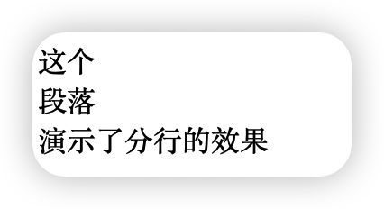


### hr水平线

`<hr/>`标签在HTML页面中创建水平线

```html
<hr color="" width="" size=""align="" />
```

属性：

1. Color：设置水平线的颜色
2. width：设置水平线的宽度
3. size：设置水平线的高度
4. align：设置水平线的对齐方式（默认居中），可取值 left｜right

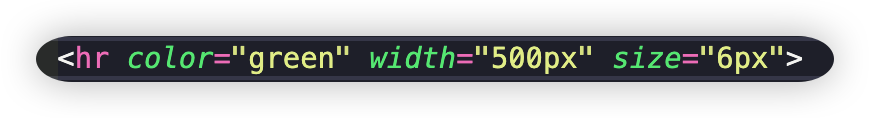

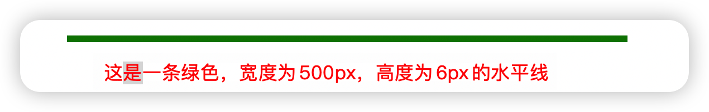

----

## 标签之文本


#### 常用文本标签

|    标签    | 描述               |
| :--------: | ------------------ |
|   `<em>`   | 定义着重文字       |
|   `<b>`    | 定义粗体文本       |
|   `<i>`    | 定义斜体字         |
| `<strong>` | 定义加重语气       |
|  `<del>`   | 定义删除字         |
|  `<span>`  | 元素没有特定的含义 |

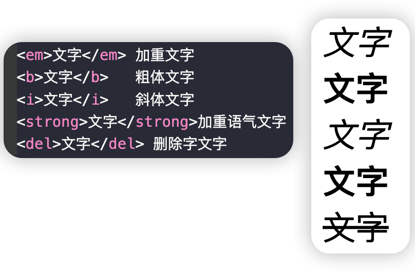

>**特别提示**
>
>常用文本标签和段落是不同的，段落代表一段文本，而文本标签一般表示文本词汇


## Img标签之图片

``标签定义HTML页面中的图像

```html

```


>注意事项
>
><`img`>是单标签，不需要进行闭合操作
>
>src是`img`标签的必须属性，它用于指定图像文件的路径和文件名


属性：

1. src：路径（图片地址与名字）

   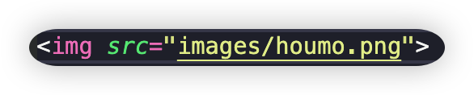

2. alt：规定图像的替代文本

   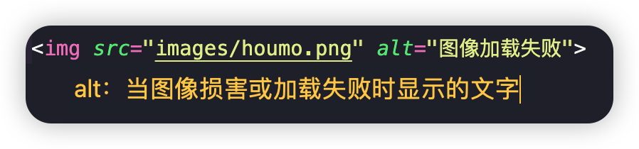

   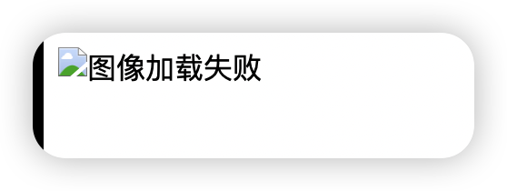

3. width：规定图像的宽度

4. height：规定图像的高度

5. title：鼠标悬停在图片上给予提示

6. boder：设置图像的边框粗细

   ```html
   
   ```

   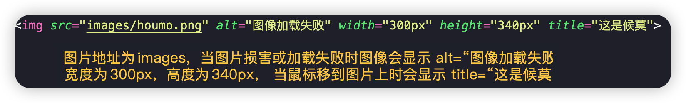

### 路径

#### 绝对路径

绝对路径是电脑的盘符存储与访问的具体地址

```html
/Users/ruan/VScode/bilibli-html/images/houmo.png
```

```html

```


#### 相对路径

两者相对关系，两者在同一路径下可以直接访问

1. 子级关系：`/`
2. 父级关系：`../`
3. 同级关系：`./`（可以省略）


#### 网络路径

具体的网络地址：``

---


## 标签之超文本链接

### 超链接描述

HTML使用标签`<a>`来设置超文本链接

超链接可以是一个字，一个词，或者一组词，也可以是一副图像，您可以点击这些内容来跳转到新的文档或者当前文档中的某个部分

```html
<a href="url" target="目标窗口的弹出方式">链接文本或图像</a>
a是单词anchor的缩写，意为：锚
```

1. **href**：用于指定链接目标的url地址，（必须属性）当为标签应用href属性时，它就具有了超链接的功能

1. **target**：用于指定链接页面的打开方式，其中_self为默认值,_blank为新窗口中打开方式 

通过点击图片跳转到指定链接

```html
<a href="url">

</a>
```

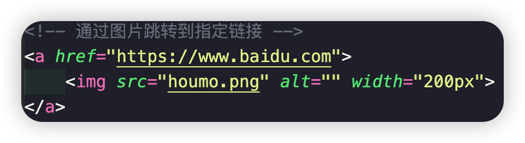

### 超链接属性

在标签`<a>`中使用了`<href>`属性来描述链接的地址

默认情况下，链接将以，以下形式出现在游览器中：

1. 一个未访问过的链接显示为蓝色字体并带有下划线

2. 访问过的链接显示为紫色并带有下划线

3. 点击链接时，链接显示为红色并带有下划线

   >**特别提示**
   >
   >后期我们会通过CSS样式修改掉这些效果

### 外部链接

```html
<a href="http://www.baidu.com">百度</a>
```

### 内部链接

网站内部页面之间的相互链接。直接链接内部页面名称即可

```html
<a href="index.html">首页</a>
```

### 空链接

如果当时没有确定链接目标时**用 # 替代**

```html
<a href="#">首页</a>
```

### 锚点定位链接

1. 锚点链接：点我们点击链接，可以快速定位到页面中的某个位置

2. 在链接文本的**href属性**中，设置属性值为**#名字的形式**

   ```html
   <a href="#two">第二集</a>
   ```

3. 找到目标位置标签，里面添加一个**id属性 = 刚才的名字**

   ```html
   <h3 id="two">第二集介绍</h3>
   ```

---

### HTML中的注释和特殊字符

#### 特殊字符

在HTML页面中，一些特俗的符号很难或者不方便直接使用，此时我们就可以使用下面的字符来替代

>   | **特殊字符** | **描述** | **字符的代码(后面全加分号;)** |
>   | ------------ | -------- | ----------------------------- |
>   |              | 空格符   | &nbsp                         |
>   | <            | 小于号   | &lt                           |
>   | >            | 大于号   | &gt                           |
>   | &            | 和号     | &amp                          |
>   | ¥            | 人民币   | &yen                          |
>   | ©️            | 版权     | &copy                         |
>   | ®️            | 注册商标 | &reg                          |
>   | ℃            | 摄氏度   | &deg                          |
>   | ±            | 正负号   | &plusmn                       |
>   | ✖️            | 乘号     | &times                        |
>   | ➗            | 除号     | &divide                       |

>   **空格大于号小于号经常用**


## div和span布局标签


>1. div 和 span是没有语义的  
>
>2. ```html
>   <div>这是div</div>
>   <span>这是span</span>
>   ```
>
>3.  div是division的缩写，表示分割、分区
>
>4. span意为跨度、跨距
>
>5. 特点：
>
> >1. div标签用来布局，但是现在一行只能放一个div大盒子
> >2. span标签用来布局，一行上可以放多个span小盒子


## 列表标签之有序列表

有序列表

有序列表是一列羡慕，列表项目使用数字进行标记。有序列表始于`<ol>`标签。每个列表始于`<li>`标签。

```html
<ol>
  <li>腾讯</li>
  <li>天美</li>
</ol>
```

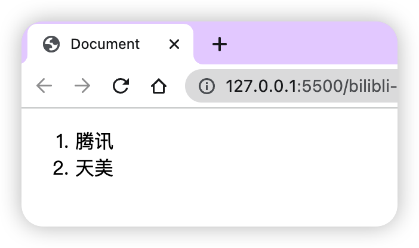

#### type属性

​	`<ol>`的属性type拥有的选项

1. 1 表示列表项目用数字标号（1,2,3……）

2. a 表示列表项目用小写字母标号（a,b,c...）

3. A 表示列表项目用大写字母标号（A,B,C...）

4. i 表示列表项目用小写罗马数字标号（i,ii,iii...）

5. I 表示列表项目用大写罗马数字标号（I,II,III....）

   ```html
   <ol type="A">
     <li>苹果</li>
     <li>橘子</li>
   </ol>
   ```

   

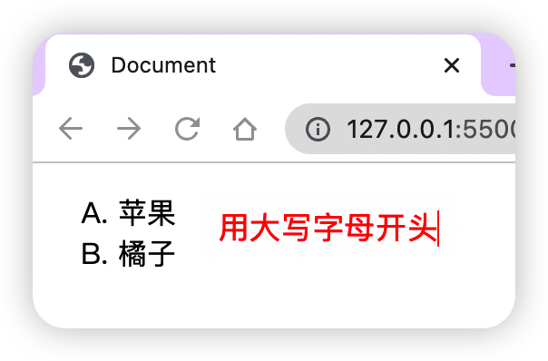

#### 有序列表嵌套

列表是可以进行嵌套的

```html
<ol>
</ol>
  <li>
    水果
    <ol>
      <li>苹果</li>
      <li>橘子</li>
      <li>香蕉</li>
    </ol>
  </li>
  <li>蔬菜</li>
</ol>
```

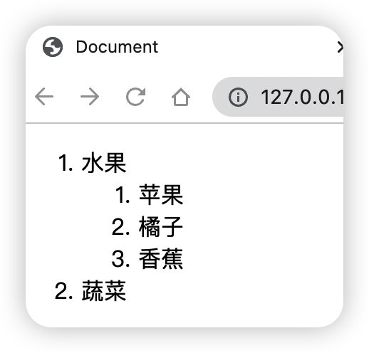

---


## 列表标签之无序列表

#### 无序列表实现

无序列表是一个项目的列表，此列表项目使用粗体圆点（典型的小黑圆圈）进行标记

无序列表始于`<ul>`标签。每个列表始于`<li>`标签

```html
<ul>
  <li>阿里巴巴</li>
  <li>蚂蚁花呗</li>
</ul>
```

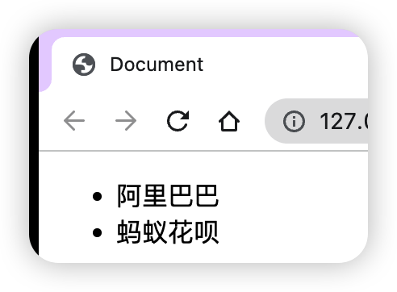

#### type属性

`<ul>`的属性type拥有的选项

- disc 默认实心圆
- circle 空心圆
- square 小方块
- none 不显示

```html
<!-- 实心圆 -->
<ul type="disc">
    <li>阿里巴巴</li>
</ul>
<!-- 空心圆 -->
<ul type="circle">
    <li>小米</li>
</ul>
<!-- 小方块 -->
<ul type="square">
   <li>腾讯</li>
</ul>
<!-- 不显示 -->
<ul type="none">
   <li>网易</li>
</ul>
```

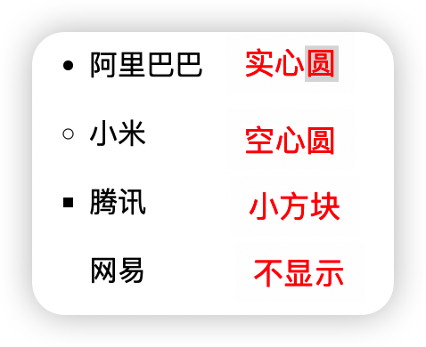

#### 无序列表嵌套

```html
<ul type="disc">
        <li>阿里巴巴
            <ol>
                <li>支付宝</li>
                <li>淘宝
                    <ul type="none">
                        <li>衣物</li>
                        <li>食物</li>
                        <li>数码</li>
                    </ul>
                </li>
                <li>蚂蚁花呗</li>
            </ol>
        </li>
    </ul>
<ul></ul>无序列表里面套了<ol></ol>有序列表,里面又嵌套了<ul></ul>无序列表
```

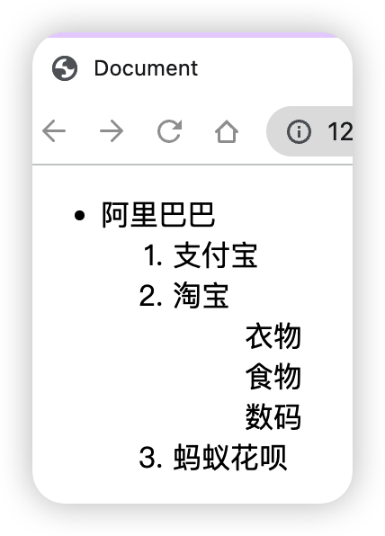


#### 常见应用场景

1. 无序列表效果
2. 导航效果

大多数导航效果都是用`<ul>`标签

#### 导航效果

```html
<ul>
  <li>xiaomi手机</li>
  <li>redmi红米</li>
  <li>电视</li>
  <li>笔记本</li>
</ul>
```

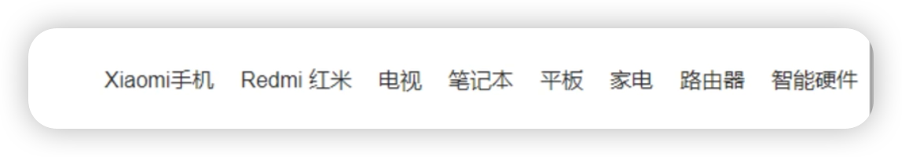


>**快捷键**
>
>快速生成ul+li的布局：ul>li*3（数字根据自己的需要的li数量修改）


## 列表标签之自定义列表（重点）

#### 自定义列表的使用场景：

自定义列表常用于对术语或名词进行解释和描述，定义列表的列表前没有任何项目符号 

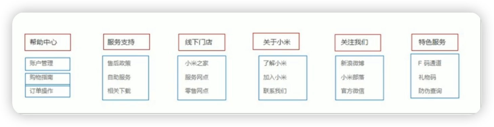


在HTMl标签中，`<dl>`标签用于定义描述列表（或定义列表），该标签会与`<dt>`(定义项目/名字)和`<dd>`（描述每一个项目/名字）一起使用

#### 其基本语法如下：

```html
<dl>
  <dt>名词1</dt>			dt和dd属于同一级关系
  <dd>名词1解释1</dd>
  <dd>名词1解释2</dd>
</dl>
```

1. `<dl>``</dl>`里面只能包含`<dt>`和`dd`
2. `<dt>`和`<dd>`个数没有限制，经常是一个`<dt>`对应多个`<dd>`

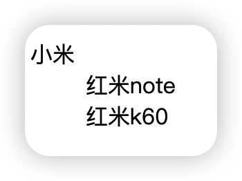


## 标签之表格

#### 表格展示效果

表格在数据展示方面非常简单，并且表现优秀

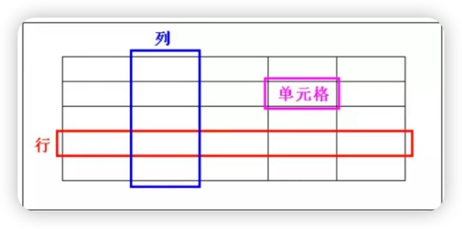

>**表格组成与特点**
>
>行、列、单元格
>
>单元格特点：同行等高、同列等宽
>
>---
>
>表格标签
>
>表格：`<table>`
>
>行：`<tr>`
>
>单元格(列)：`<td>`

```html
   <table>
        <tr>
            <td>地址</td>
            <td>年龄</td>
            <td>身高</td>
        </tr>
        <tr>
            <td>山东</td>
            <td>19</td>
            <td>180</td>
        </tr>
    </table>
```

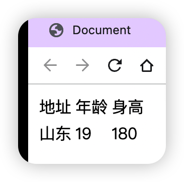

>#### 快捷键
>
>快速生成表格结构：**table>tr*2>td{单元格}** 

```html
table>tr*3>td{单元格快捷键}
```

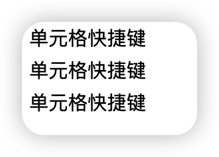

#### 表格属性

1. border：设置表格的边框

   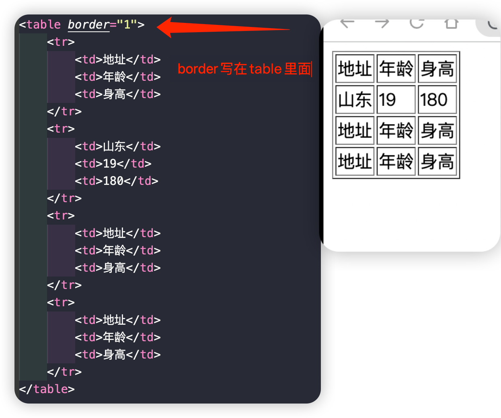

2. width：设置表格的宽度

3.  height：设置表格的高度

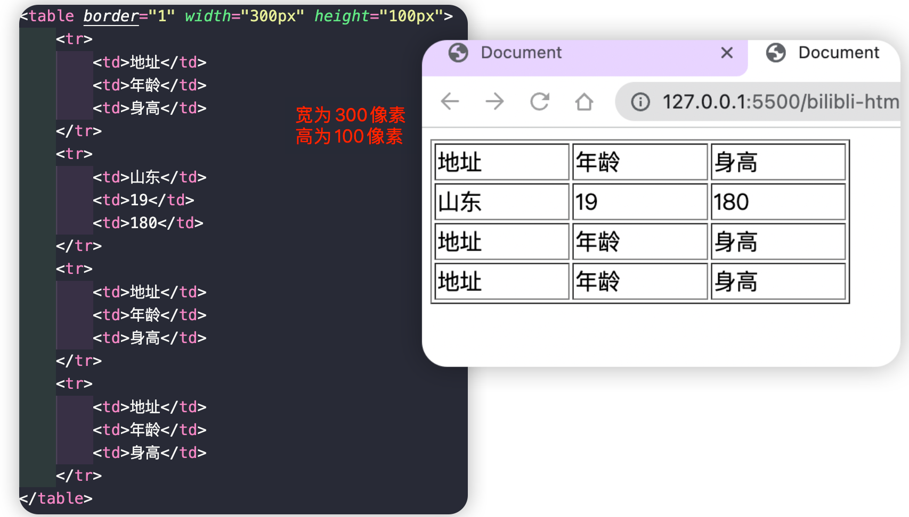

4. align： Left、center、right  规定表格相对周围元素的对齐方式
5. cellpadding  像素 值  规定单元边沿或其内容之间的空白，默认1像素
6. cellspacing  像素值  规定单元格之间的空白，默认2像素。

#### 表格单元格合并

单元格合并属性：

- 水平合并：colspan

  保留左边，删除右边

```html
<table border="1" width="360px" height="200px">
        <tr>
            <td>单元格1</td>
            <td>单元格2</td>
            <td>单元格3</td>
            <td>单元格4</td>
        </tr>
        <tr>
            <td>单元格5</td>
            <td colspan="2">单元格6</td>
            <td>单元格8</td>
        </tr>
        <tr>
            <td>单元格9</td>
            <td>单元格10</td>
            <td>单元格11</td>
            <td>单元格12</td>
        </tr>
        <tr>
            <td>单元格13</td>
            <td>单元格14</td>
            <td>单元格15</td>
            <td>单元格16</td>
        </tr>
    </table>
```

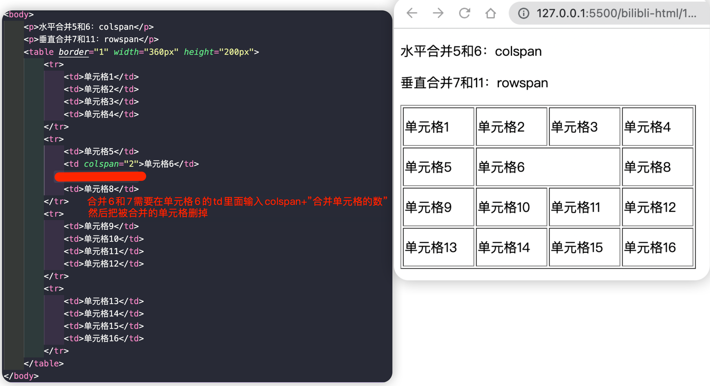

- 垂直合并：rowspan

  保留上边，删除下边

```html
 <table border="1" width="360px" height="200px">
        <tr>
            <td>单元格1</td>
            <td>单元格2</td>
            <td>单元格3</td>
            <td>单元格4</td>
        </tr>
        <tr>
            <td>单元格5</td>
            <td>单元格6</td>
            <td rowspan="2">单元格7</td>
            <td>单元格8</td>
        </tr>
        <tr>
            <td>单元格9</td>
            <td>单元格10</td>
            <td>单元格12</td>
        </tr>
        <tr>
            <td>单元格13</td>
            <td>单元格14</td>
            <td>单元格15</td>
            <td>单元格16</td>
        </tr>
    </table>
```

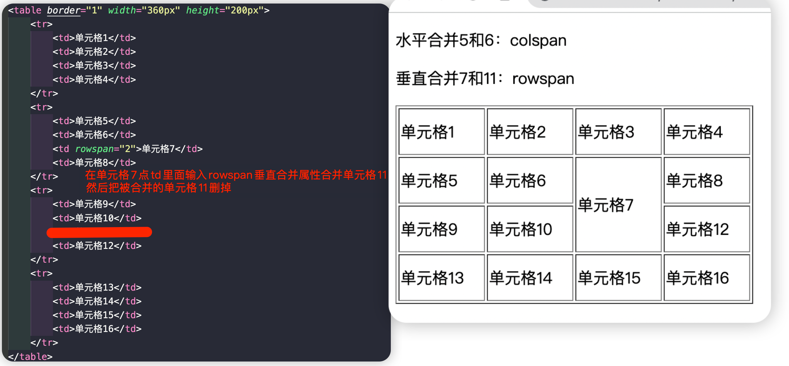

 


## Form表单

表单在Web网页中用来给用户填写信息，从而能采用户信息，使网页具有交互的功能

所有的用户输入的内容都用表单来写，如登陆注册、搜索框

表单是由容器和控件组成的,一个表单一般应该包含用户填写信息的输入框,提交按钮等，这些输入框,按钮叫做控件,表单就是容器,它能够容纳各种各样的控件

```html
<form action="url" method="get｜post" name="myform"></form>
```

>##### **属性说明**
>
>action服务器地址
>
>name表单名词
>
>method中Get和Postd的区别
>
>1. 数据提交方式，get把提交的数据url可以看到，post看不到
>2. get一般用于提交少量数据，post用来提交大量数据

### 表单元素

一个完整的表单包含三个基本组成部分：表单标签、表单域、表单按钮

1. 表单标签

2. 表单域（form）

3. 表单按钮

   ```html
   <form>
   <input type="text">
   <input type=submit>
   </form>
   ```

   

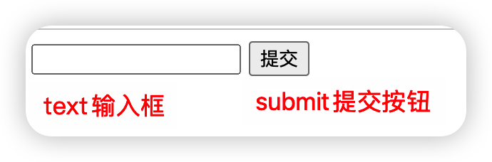

### input type输入表单元素

| 属性值   | 描述                                                         |
| -------- | ------------------------------------------------------------ |
| button   | 定义可点击按钮（多数情况下，用于通过js启动脚本）             |
| checkbox | 定义复选框                                                   |
| file     | 定义输入字段和“游览”按钮，供文件上传                         |
| hidden   | 定义隐藏的输入字段                                           |
| image    | 定义图像形式的提交按钮                                       |
| password | 定义密码字段，该字段中的字符被淹码                           |
| radio    | 定义单选按钮                                                 |
| reset    | 定义重置按钮，重置按钮会清楚biaodan                          |
| submit   | 定义提交按钮，提交按钮会把表单数据发送到服务器               |
| text     | 定义单行的输入字段，用户可在其中输入文本。默认宽度为20个字符 |

#### text文本框

文本框通过`<input type="text">`标签来设定，当用户要在表单中键入字母、数字等内容时，就会用到文本域

```html
<form>
名：<input type="text" name="mingname">
  <br /> 
姓：<input type="text" name="xingname">
</form>
```

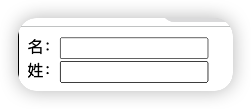

####  password密码框

密码字段通过标签`<input type="password">`来定义

```html
<form>
密码：<input type="paswword" name="pwd">
</form>
```


>温馨提示
>
>密码字段字符不会明文显示，而是以星号或圆点替代


#### radio单选按钮

```html
<form name="input" action="url" method="get">
 man: <input type="radio" name="sex"> 
 woman: <input type="radio" name="sex">
</form>
```

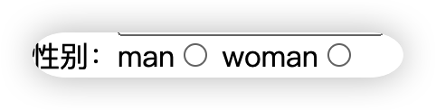

>如果要实现2选1，需要在**name属性**里面填写一样的数值


#### checkbox复选框

如果要有多种选择可以使用checkbox定义复选框

```html
<form name="input" action="url" method="get">
爱好：篮球<input type="checkbox"> 足球<input type="checkbox"> 羽毛球<input type="checkbox">
</form>
```


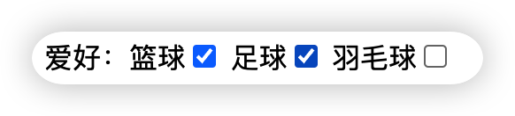

#### submit提交按钮

当用户点击确认按钮时，表单等内容会被传送到另一个文件。表单的动作属性定义了目的文件的文件名。由动作属性定义的这个文件通常会对接收到的输入数据进行相关的处理

```html
<form name="input" action="url" method="get">
  Username:<input type="text" name="user">
  <input type="submit" value="Submit">
</form>
```

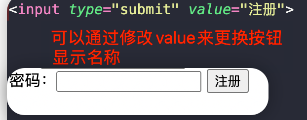


#### reset重置按钮

`reset`

重置按钮可以还原表单元素初始的默认状态

```html
<input type="reset" value="重新填写">
```


**可以使用value来更换按钮显示名称**


#### button普通可点击按钮

`button`普通按钮（一般配合js脚本使用）

```html
<input type="button" value=“获取短信验证码”>
```

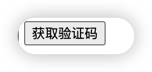

**可以使用value来更换按钮显示名称**


#### file文件域上传

`file`文件域使用场景 长传文件使用的

```html
上传：<input type="file">
```

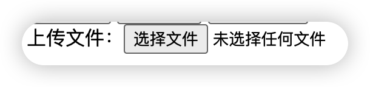


### input属性

| 属性      | 属性值       | 描述                                |
| --------- | ------------ | ----------------------------------- |
| name      | 由用户自定义 | 定义input元素的名称                 |
| value     | 由用户自定义 | 规定input元素的值                   |
| checked   | checked      | 规定此input元素首次加载时应当被选中 |
| maxlength | 正整数       | 规定输入字段中的字符的最大长度      |


#### value打开页面就默认显示文字

`value`属性是表单框里显示的文字


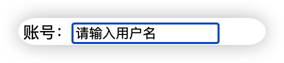

1. name和value是每个表单元素都有的属性值，主要给后台人员使用
2. name表单元素的名字，要求**单选按钮和复选框要有相同的name值**


#### name属性

当input表单的名字，后台可以通过这个name属性找到这个表单，页面中的表单很多，那么大主要作用就是用于区别不同的表单

```html
用户名：<input type="text" value="请输入用户名" name="username"/>
```

Name属性后的值，是自定义的

**radio（或者checkbox）如果是一组，我们必须给他们命名相同的名字**

```html
<input type="radio" name="sex"/>男
<input type="radio" name="sex"/>女
```


#### checked首次加载被选中属性

**checked**

单选按钮和复选框可以设置**checked属性**，当页面打开的时候就可以默认选中这个按钮

```html
<form>
爱好：篮球<input type="checkbox" checked="checkbox"> 足球<input type="checkbox"> 羽毛球<input type="checkbox">
</form>
```

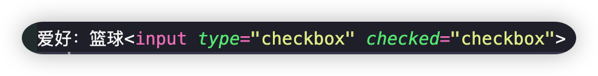

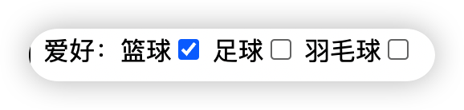

**checked属性主要针对于单选看和复选框**，主要作用一打开页面，就要可以默认选中某个表单元素


#### maxlength规定输入字段最大长度

**maxlength="最大长度"**

```html
<form>
  账号：<input type="text" name="username" maxlength="6">
</form>
```

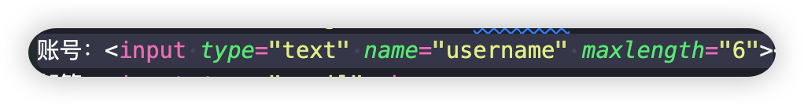

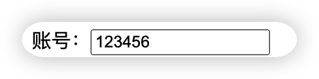

**maxlength="6"**规定文本框里最多输入6个字符

maxlength是用户可以在表单元素输入的最大字符数，一般较少使用

 

#### label光标自动定位标签

`<label>`标签为input元素定义标注（标签）

`<label>`标签用于绑定一个表单元素，当点击`<label>`标签内的文本时，游览器会自动将焦点（光标）转到或者选择对应的表单元素上,用来增加用户体验


```html
<form>
  <label for="sex">男</label>
  <input type="radio" name="sex" id="sex" />
</form>
```

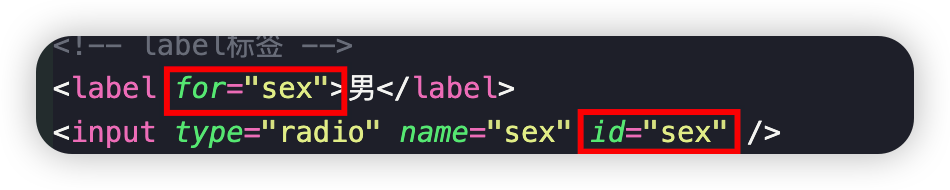

>`<label>`标签的**for属性**应当与相关元素的**id属性相同**


### select下拉表单元素

**`<select>`表单元素**

使用场景：在页面中，如果有多个选项让用户选择，并且想要节约页面空间时，我们可以使用`<select>`标签控件定义**下拉列表**

```html
<form>
地址：<select>
<option>选项1</option>
<option>选项2</option>
<option>选项3</option>
...
</select>
</form>
```

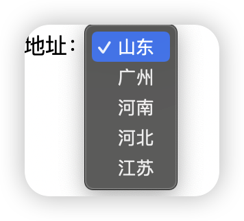

>1. `<select>`中至少包含一对`<option>`
>
>2. 在`<option>`中定义**selected="selected"**时，当前项即为默认选中项


###  textarea文本域标签

`textarea`表单元素

使用场景：当用户输入内容较多的情况下，我们就不能使用文本框表单了，此时我们可以使用`<textarea>`标签

在表单元素中，`<textarea>`标签适用于定义多行文本输入的控件

使用多行文本输入控件，可以输入更多的文字，该控件常见于留言板，评论

```html
<form>
<textarea rows="3" cols="20">
  文本内容
  </textarea>
</form>

```

>1. 通过`<textarea>`标签可以轻松地创建多行文本输入框
>2. cols=“每行中的字符数”，rows=“显示的行数”，**我们实际开发中不会使用，都是用CSS来改变大小**


 

## 块元素与行内元素（内联元素）

**内联元素和块级元素的区别**

| 块级元素                                     | 内敛元素                                     |
| -------------------------------------------- | -------------------------------------------- |
| 块元素会在页面中独占一行（自上向下垂直排列） | 行内元素不会独占页面中的一行，只占自身的大小 |
| 可以设置width，height属性                    | 行内元素设置width，height属性无效            |
| 一般块级元素可以包含行内元素和其他块级元素   | 一般内联元素包含内联元素不包含块级元素       |


### 常见块级元素

>div、form、h1～h6、hr、p、table、ul、等


### 常见内联元素（行内元素）

>a、b、em、i、span、strong等


### 行内块级元素（特点：不换行、能够识别宽高）

>button、img、input等


## H5布局新标签

H5新标签实现

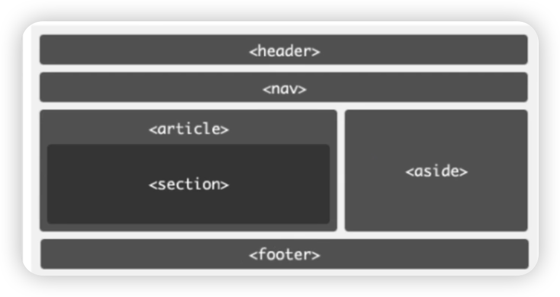

 

#### H5新标签

1. `<header></header>`头部
2. `<nav></nav>`导航
3. `<section></section>`定义文档中的节,比如章节、页眉、页脚
4. `<aside></aside>`侧边栏
5. `<footer></footer>`脚部
6. `<article></article>`代表一个独立的、完整的相关内容块,例如一篇完整的论坛帖子，一篇博客文章，一个用户评论等

```html
<header></header>
<nav></nav>
<article>
  <section></section>
</article>
<aside></aside>
<footer><footer>
```


# CSS

#### CSS概念

CSS（Cascading Style Sheets）层叠样式表，又叫级联样式表，简称样式表

CSS文件后缀名为`.css`

CSS用于HTML文档中元素样式的定义


#### 语法

`<style></style>`

CSS规则由两个主要的部分构成：选择器，以及一条或多条声明

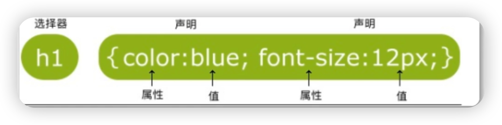

选择器通常是您需要改变样式的HTML元素

每条声明由一个属性和一个值组成

属性（property）是您希望设置的样式属性（style attribute）。每个属性有一个值。属性和值被冒号分开 

```html
<style>
  h1{
    color:blue
      font-size:12px
  }
</style>
```


### CSS的引入方式

#### 内联样式（行内样式）

要是用内联样式，你需要在相关的标签内使用样式（style）属性。Style属性可以包含任何CSS属性

>提示
>
>缺乏整体性和规划性，不利于维护，维护成本高

```html
<p style="background:orange; font-size:24px">CSS</p>
```


#### 内部样式

当单个文档需要特殊的样式时，就应该使用内部样式表。你可以使用`<style>`标签在文档头部定义内部样式表

>提示
>
>单个页内的CSS代码具有统一性和规划性，便于维护，但是在多个页面之间容易混乱

```html
<head>
  <style>
    h1{
      background:red;
    }
  </style>
  
</head>
```


#### 外部样式（推荐）

 当样式需要应用于很多页面时，外部样式表将是理想的选择。在使用外部样式表带情况下，你可以通过改变一个文件来改变整个站点的外观。每个页面使用`link`标签链接到样式表。`<link>`标签在（文档的）头部

```html
<link rel="stylesheet" type="text/css" href="xxx.css">
```


# 选择器

CSS语法 规则由两个主要的部分构成：**选择器**，以及一条或多条声明（样式）

### 全局选择器

可以与任何元素匹配，优先级最低，一般做样式初始化

```CSS
*{
  margin: 0;
  padding: 0;
}
```


### 标签选择器

HTML文档中的元素，`p、b、div、img、body`等

标签选择器，选择的是页面上所有这种类型的标签，所以经常描速“共性”，无法描述某一个元素的“个性”

```css
p{
  font-size:14px;
}
```

在比如说，我想让“学完前端，继续学java”这句话中的“前端”两个变为红色字体，那么我可以用`<span>`标签把“前端”这两个字围起来，然后给`<span>`标签加一个标签选择器

```html
<p>学完了<span>前端</span>，继续学java</p>
span{
color:red;
}
```

>温馨提示
>
>1. 所有的标签，都可以是选择器
>2. 无论这个标签藏的多深，一定能够被选择上
>
>3. 选择的所有，而不是一个


### 类选择器

规定用圆点.来电影，针对你想要的所有标签使用

>.类名{
>
>}

```html
<h2 class="oneclass">你好</h2>
/*定义类选择器*/
.oneclass{
width:80px;
}
```

>class属性的特点
>
>1. 类选择器可以被多种标签使用
>2. 类名不能以数字开头
>3. 同一个标签可以使用多个类选择器。用空格隔开

```html
<h3 class="classone classtwo">我是一个h3</h3>
```

### 类选择器-多类名

我门可以给一个标签指定**多个类名**，从而达到更多的选择目的。这些类名都可以选出这个标签.简单理解就是一个标签有多个名字

#### 多类名使用方式

```html
<div class="类选择器1 类选择器2">你好</div>
```

>1. 在标签class属性中写多个类名
>
>2. 多个类名中间必须用空格分开
>3. 这个标签就可以分别具有这些类名的样式

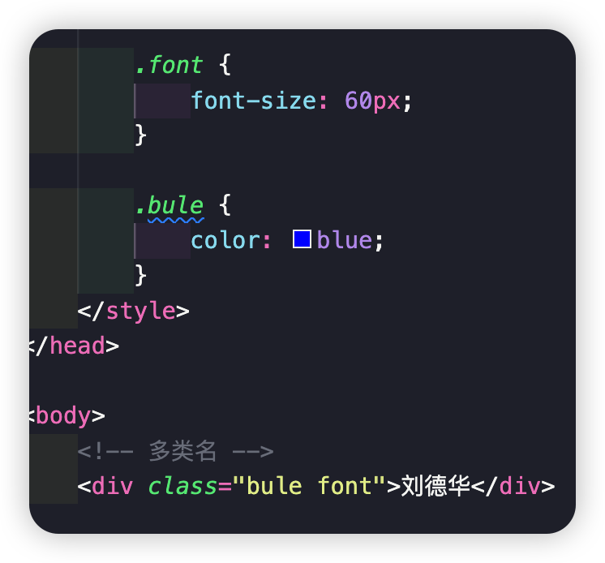

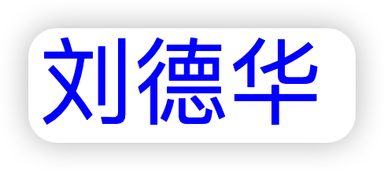

#### 可以更方便的使用

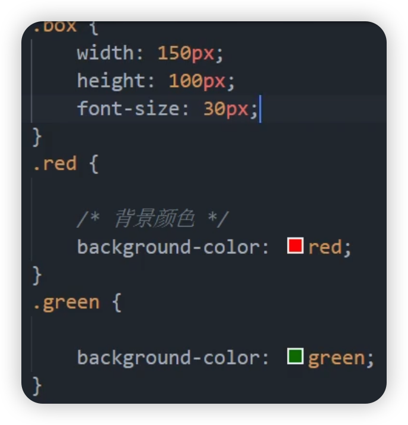

>1. 可以把一些标签元素相同的样式（共同的部分）分到一个类里面
>
>2. 这些标签都可以调用这个公共的类，然后在调用自己独有的类
>
>3. 从而节省CSS代码，方便


### 类选择器画盒子


```css
 .red {
            width: 100px;
            height: 100px;
            background-color: red;
        }

        .green {
            width: 100px;
            height: 100px;
            background-color: green;
        }
<div class="red"></div>
    <div class="green"></div>
    <div class="red"></div>
```

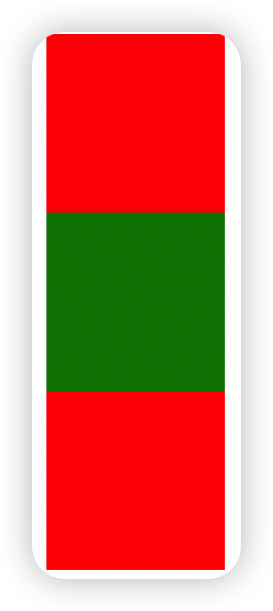

### ID选择器

针对某一个特点的标签来使用，只能使用一次。`css`中的`ID选择器`以`#`来定义

>#id名{
>
>​	属性1:属性值1;
>
>​	....
>
>}
>
>```css
>#mytitle{
>border:3px dashed green;
>}
>```

```html
<h2 id="mytitle">你好</h2>
```

>**样式#定义，结构id调用，只能调用一次**
>
>1. ID是唯一的
>2. ID不能以数字开头


### 基础选择器总结

| 基础选择器   | 作用                          | 特点                               | 使用情况     | 用法             |
| ------------ | ----------------------------- | ---------------------------------- | ------------ | ---------------- |
| 标签选择器   | 可以选出所有相同的标签，比如p | 不能差异化选择                     | 较多         | p{color:red;}    |
| 类选择器     | 可以选出1个或多个标签         | 可以根据需求选择                   | 非常多       | .nav{color:red;} |
| id选择器     | 一次只能选择1个标签           | ID属性只能在每个HTML文档中出现一次 | 一般和js搭配 | #nav{color:red;} |
| 通配符选择器 | 选择所有的标签                | 选择的太多，有部分不需要           | 特俗情况使用 | *{color:red;}    |


### 合并选择器

语法：`选择器1,选择器2,....{}`

作用：提取共同的样式，减少重复代码

```css
.header，.footer{
  height:300px;
}
```


### 选择器的优先级

CSS中，权重用数字衡量

元素选择器的权重为：1

class选择器的权重为：10

id选择器的权重为：100

内联样式的权重为：1000

优先级从高到低：行内样式>ID选择器>类选择器>元素选择器

行内样式最高


# CSS字体属性

CSS Fonts(字体)属性用于定义**字体系列**，颜色、大小、加粗、文字样式

### font-family文字的字体

CSS使用**font-family**属性定义文本的字体系列

```css
p{font-family:"微软雅黑"}
font-family:"Microsoft YaHei";	英文微软雅黑
```

>1. 各种字体之间必须使用英文状态下的逗号隔开
>
>2. 如果字体名词包含空格，他必须加上引号


### font-size字体大小

CSS使用**font-size**属性定义字体大小

```css
p{font-size:20px;}
```

1. px(像素)大小是我们网页的最常用的单位
2. 谷歌游览器默认的文字大小为16px
3. 可以给body指定整个页面文字大小

>标题标签笔记特殊，需要单独制定文字大小


### font-weight文本粗细

CSS使用**font-weight**属性设置

| 值      | 描述                                      |
| ------- | ----------------------------------------- |
| bold    | 定义粗体字符                              |
| bolder  | 定义更粗的字符                            |
| lighter | 定义更细到字符                            |
| 100~900 | 定义由细到粗 400等同默认，而700等同于bold |

```css
h1{font-weight:normal;}
div{font-weight:bold;}
最常用的是100～900
font-weight:700;
```


### font-style文本字体样式

CSS使用**font-style**属性设置文本的风格

```css
p{
  font-style:normal;
}
```


| 值     | 描述       |
| ------ | ---------- |
| normal | 默认值     |
| italic | 定义斜体字 |


### font字体属性复合属性

复合属性：简写的方式

```css
font: italic 700 16px 'Microsoft yahei'
```

>```css
>body{
>  font:font-style font-weight font-size/line-height font-family;
>}
>```
>
>1. 使用font属性时,必须按上面的语法格式中的顺序书写，**不能更换顺序**，并且各个属性间以**空格**隔开
>
>2. 不需要设置的属性可以省略（取默认值），但**必须保留font-size和font-family属性**，否则font属性将不起作用

### 字体属性总结

| 属性        | 表示     | 注意点                                                       |
| ----------- | -------- | ------------------------------------------------------------ |
| font-size   | 字号     | 我们通常用的单位时px像素                                     |
| font-family | 字体     | 实际工作按照团队约定来书写                                   |
| font-weight | 字体粗细 | 加粗是700或者bold 不加粗是normal或者400 数字不要跟单位       |
| font-sytle  | 字体样式 | 倾斜时italic 不倾斜是normal 工作中常用normal                 |
| font        | 字体连写 | 字体连写是有顺序的 不能随意换位置，其中字号和字体必须同时出现 |

# CSS文本属性

CSS Text（文本）属性可定义文本的**外观**，比如文本的颜色、对齐文本、文本缩进、行间距等

### color文本颜色

**color**属性用于定义文本的颜色

```css
div{
color:red;
}
```

| 表示           | 属性值             |
| -------------- | ------------------ |
| 预定义的颜色值 | Red,green,blue等等 |
| 十六进制       | #FF0000，#FF6600等 |
| RGB代码        | rgb（255,0,0）等等 |


### text-align对齐文本

**text-align**属性用于设置元素内文本内容等水平对齐方式

```css
div{
  text-align:center;
}
```

| 属性值 | 解释             |
| ------ | ---------------- |
| left   | 左对齐（默认值） |
| right  | 右对齐           |
| center | 居中对齐         |


### text-decoration装饰文本

**text-decoration**属性规定添加到文本的修饰。可以给文本添加下划线、删除线、上划线等

```css
div{
text-decoration:underline;
}
```

| 属性值       | 描述                            |
| ------------ | ------------------------------- |
| none         | 默认。没有装饰线（最常用）      |
| underline    | 下划线。链接a自带下划线（常用） |
| overline     | 上划线                          |
| line-through | 删除线                          |

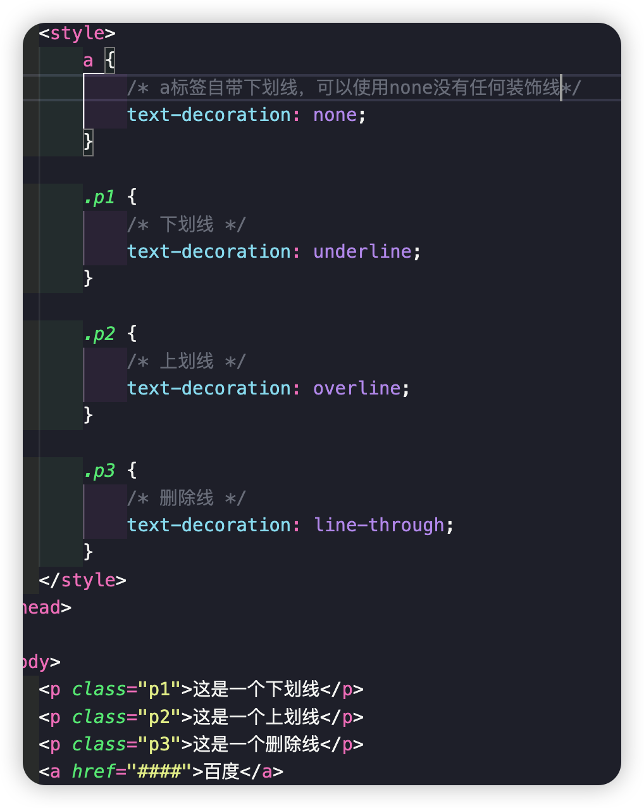

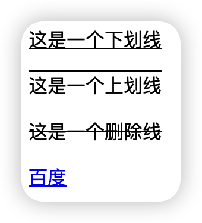


### text-indent文本缩进

**text-indent**属性用来指定文本的第一行缩进，通常是将段落的首行缩进

```css
div{
  text-indent:10px	首行缩进10像素
}
```

```css
p{
  text-indent:2em;
}
```

>**em**是一个相对单位，就是当前元素（font-size）**1个文字的大小**，如果当前元素没有设置大小，则会按照父元素的1个文字大小


### line-height行间距

**line-height**属性用于设置行间的距离（行高）。可以控制文字行与行之间的距离

```css
p{
line-height:26px;
}
```

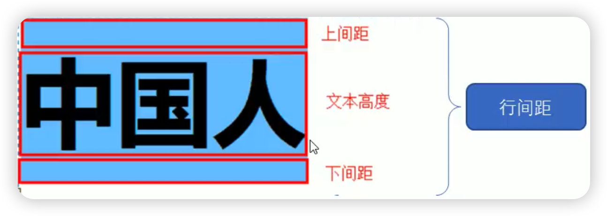

>文字默认16像素
>
>如果设置行高为26px，则上间距和下间距分别为5px


## 文本属性总结

| 属性            | 表示     | 注意点                                       |
| --------------- | -------- | -------------------------------------------- |
| color           | 文本颜色 | 通常用十六进制#fff                           |
| text-align      | 文本对齐 | 可以设定文字水平的对齐方式                   |
| text-indent     | 文本缩进 | 用于段落首行缩进2个字的距离 text-indent:2em; |
| text-decoration | 文本修饰 | 添加下划线 underline    取消下划线 none      |
| line-height     | 行高     | 控制行与行之间的距离                         |


# CSS背景属性

CSS背景属性主要有以下几个

| 属性                | 描述                 |
| ------------------- | -------------------- |
| background-color    | 设置背景颜色         |
| background-image    | 设置背景图片         |
| background-position | 设置背景图片显示位置 |
| background-repeat   | 设置背景图片如何填充 |
| background-size     | 设置背景图片大小属性 |


### 背景颜色

**background-color**

```css
.box{
  width:300px;
  height:300px;
  background-color:
}
```

